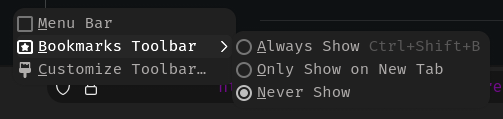

# About

My tailor-fitted, highly customized, and advanced [Firefox](https://www.mozilla.org/en-US/firefox) configuration.

> [!NOTE]
> This repository is not meant to be used as a whole but rather as a reference for my own configuration. I do not recommend using it as is, as it is not meant to be used by anyone else. I do not provide any support for this repository. If you want to use it, you are on your own.
>
> For other experimental features, check out the other branches of this repository.

> [!IMPORTANT]
> Firefox occasionally changes its codebase, which may break some of the configurations on newer versions of Firefox. I try to keep this repository updated, but I cannot guarantee that everything will work as expected. To deal with it yourself, refer to the [Customizing Firefox](#customizing-firefox) section.

> [!TIP]
> Customizing Firefox: For detailed guidance on customizing Firefox to suit your needs, refer to the [Customizing Firefox](#customizing-firefox) section. _TL;DR_: To find and inspect browser's selectors see: [Browser Toolbox](https://developer.mozilla.org/en-US/docs/Tools/Browser_Toolbox).
>
> Disable Telemetry and Data Collection: Ensure that all telemetry and data collection features are turned off in Firefox. You can use my `user.js` as a reference, and explore other `user.js` files and hardened Firefox configurations for additional security.
>
> Cookie Management: With cookie isolation enabled, clearing cookies may be less effective. Instead, consider using temporary containers for better privacy.
>
> JPEG XL (JXL): Firefox 128 now supports JPEG XL images. You can use the [JPEG XL](https://jpeg.org/jpegxl/) format for images to save bandwidth and improve loading times. It is available as `image.jxl.enabled` in `about:config` preference. You can enable it by setting it to `true`. Note that it is currently an experimental feature in Firefox 128+.

## Features

- Smooth scrolling
- Animations throughout the UI
- Auto-hiding sidebar (Sidebery)
- Hovercards
- Scrollable tabs
- Searchable sidebar for tabs
- Custom toolbar icons
- Bouncing loading indicator
- Icons only in the extensions menu
- Icons in main menu items
- Rounded UI elements
- Dark theme for pages (e.g., addons.mozilla.org)
- Centered status panel with animations
- Compact about:config list
- Compact menus and items (e.g., context menu)
- Sidebar tweaks (Sidebery, Tree Style Tab) with auto-hide
- Tab animations for audio playback
- Consistent and matching UI colors
- Hover effects (glow and scale) on toolbar buttons
- Floating find bar at the top
- Hidden horizontal tab bar
- Bottom toolbar and search/url bar
- Hidden bookmarks toolbar (visible on hover)
- Custom colors for various elements
- Centered text in the url bar
- Colored overlay in the url bar based on connection type
- RGB animation in the url bar
- Global font family and size
- Various fixes and tweaks
- Custom addons configuration
- Context menu tweaks (no separators, compact, custom colors & icons, rounded borders)
- Custom theme
- Icons in menus (appmenu, context menu, main menu, etc.)
- Performance and privacy tweaks
- JPEG XL (JXL) enabled by default
- Per-site UI/UX tweaks (e.g., YouTube, Google, ChatGPT, Mozilla, about:config)

## Screenshots and GIFs

## Installation

### Enabling `userChrome.css` and `userContent.css`

Enable `userChrome.css` and `userContent.css` support in Firefox:

1. Go to `about:config` and click the "Accept the Risk and Continue" button.
2. In the search box, type `toolkit.legacyUserProfileCustomizations.stylesheets`.
3. Double-click the `toolkit.legacyUserProfileCustomizations.stylesheets` entry to set its value to **`true`**.
4. Restart Firefox.

### File Locations

Both `user.js` and `chrome` files should be placed in the following locations depending on your operating system:

| OS      | Location                                                               |
| ------- | ---------------------------------------------------------------------- |
| Linux   | `~/.mozilla/firefox/<profile_ID>.default/`                             |
| Windows | `%APPDATA%\Mozilla\Firefox\Profiles\<profile_ID>.default/`             |
| macOS   | `~/Library/Application Support/Firefox/Profiles/<profile_ID>.default/` |

Replace `<profile_ID>` with your Firefox profile ID.

### Finding Your Default Profile

- **Linux**: You can find your default profile in `~/.mozilla/firefox/profiles.ini` OR go to `about:support` in Firefox, you'll see your default profile directory in the `Profile Directory` section. Click on `Open Directory`.

- **Windows**: Your default profile can be found at `%APPDATA%\Mozilla\Firefox\Profiles\`. Alternatively, navigate to `about:support` in Firefox, and click on `Open Folder` next to the `Profile Directory` section.

- **macOS**: Locate your default profile in `~/Library/Application Support/Firefox/Profiles/`. Or, go to `about:support` in Firefox, and click on `Show in Finder` next to the `Profile Directory` section.

## Theme

The theme I'm currently using: [RosyBrown Dark by Me](https://addons.mozilla.org/en-US/firefox/addon/rosybrown_dark/)

## Addons

For addons and userscripts configuration, you can find them in the respective directories.

You can find a list of addons I use [here](https://addons.mozilla.org/en-US/firefox/collections/17970682/TAT-Collection/). Note that I don't use all of them (not even a third), and many of the addons listed can be replaced by uBlock Origin.

## Additional Tweaks

### Toolbar

Go to `Open application menu > More tools > Customize toolbar...` and make the following changes:

Set Density to `Normal` and uncheck Title Bar.

To disable bookmarks toolbar:

## Customizing Firefox

> [!NOTE]
> [The Toolbox (ctrl-shift-c) is used to inspect web pages](https://firefox-source-docs.mozilla.org/devtools-user/tools_toolbox/index.html)
>
> [The Browser Toolbox (ctrl-alt-shift-i) is used to inspect the interface (parent process only) and/or web pages (multiprocess)](https://firefox-source-docs.mozilla.org/devtools-user/browser_toolbox/index.html)

If you're planning to make multiple and extensive alterations to your UI, learning how to use the [Browser Toolbox](https://firefox-source-docs.mozilla.org/devtools-user/browser_toolbox/index.html) is essential. It allows you to create modifications to the UI and fix those modifications if a newer version of the Firefox codebase causes issues.

While the Browser Toolbox isn't particularly user-friendly to set up or use initially, perseverance will pay off as it is key to inspecting Firefox's UI. Check out the [r/firefoxcss wiki](https://www.reddit.com/r/FirefoxCSS/wiki/index/) and search the subreddit for specific posts.

Investigate how to use Mozilla's source code indexing tool [SearchFox](https://searchfox.org) as well.

Most of your "How to" questions can be answered by the Browser Toolbox and SearchFox, though it takes some time to understand them both from scratch.

As an alternative to using the Browser Toolbox and SearchFox, you can explore the wealth of information in subreddits like [r/FirefoxCSS](https://www.reddit.com/r/FirefoxCSS) ([it's tutorials](https://www.reddit.com/r/FirefoxCSS/wiki/index/tutorials)), [r/firefox](https://www.reddit.com/r/firefox/), and [r/unixporn](https://www.reddit.com/r/unixporn/). Finding the precisely relevant information often requires diligent searching with a variety of **keywords**. A useful trick is to search with a section of CSS userstyle, a selector, or a rule related to the UI element you want to modify. You can also look on GitHub, GitLab, and other code hosting sites, or simply use your favorite search engine. There are various articles and blogs online as well. Discord servers like [unixporn](https://discord.com/invite/unixporn) and matrix rooms like [#firefoxcss:mozilla.org](https://chat.hackliberty.org/#/room/#firefoxcss:mozilla.org) can be helpful too.

Look for specific topics on GitHub: [userchrome](https://github.com/topics/userchrome), [firefox-css](https://github.com/topics/firefox-css), [firefox-tweaks](https://github.com/topics/firefox-tweaks), [userchrome-styles](https://github.com/topics/userchrome-styles), [userchromecss](https://github.com/topics/userchromecss).

Look for specific topic on Github Gist: [firefox css userchrome](https://gist.github.com/search?o=desc&q=firefox+css+userchrome&s=updated)

More handy resources: [Firefox CSS Guidelines](https://firefox-source-docs.mozilla.org/code-quality/coding-style/css_guidelines.html), [userchrome.org](https://www.userchrome.org), [FirefoxCSS Store](https://firefoxcss-store.github.io), [Mozilla Bugzilla](https://bugzilla.mozilla.org), [The other guide to CSS hacking](https://mrotherguy.github.io/ToyfoCSS/).

Misc resources: [Overview for beginners](https://www.reddit.com/r/FirefoxCSS/comments/ugej2i/comment/i707t5x/)

### Live Debug and Update `userChrome.css`

1. Set `devtools.debugger.remote-enabled` to `true` in `about:config`.
2. Set `devtools.chrome.enabled` to `true` in `about:config`.
3. Open remote debugger using **Ctrl+Alt+Shift+I**.
4. Allow the incoming connection.
5. Select Style Editor tab, then open `userChrome.css`.
6. Edit and save the file for it to take effect (hot reload).

## Notable Mentions

- [schizofox](https://github.com/schizofox/schizofox) - Hardened Firefox flake for the delusional and the schizophrenics. You might find some interesting stuff there.
- [Betterfox](https://github.com/yokoffing/Betterfox) - Firefox user.js for speed, privacy, and security. Your favorite browser, but better.
- [FirefoxCSS-Store](https://firefoxcss-store.github.io) - A collection site of Firefox userchrome themes.
- [r/FirefoxCSS](https://www.reddit.com/r/FirefoxCSS) - A subreddit dedicated to Firefox customization.
- [SearchFox](https://searchfox.org) - A source code indexing tool for Mozilla Firefox. It indexes C++, Rust, and JavaScript code.
- [Firefox Browser Toolbox](https://firefox-source-docs.mozilla.org/devtools-user/browser_toolbox/index.html) - A tool that helps to create and maintain extensive firefox customizations.
- [ArkenFox GUI](https://arkenfox.github.io/gui) - Site to help you explore the information from the [arkenfox user.js](https://github.com/arkenfox/user.js)
- [fx-autoconfig](https://github.com/MrOtherGuy/fx-autoconfig) - A toolkit to load arbitrary javascript files to be run in Firefox browser context. Relies on autoconfig functionality available in Firefox.
