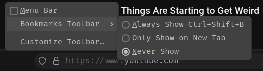
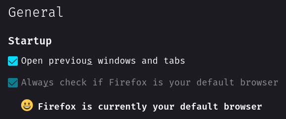
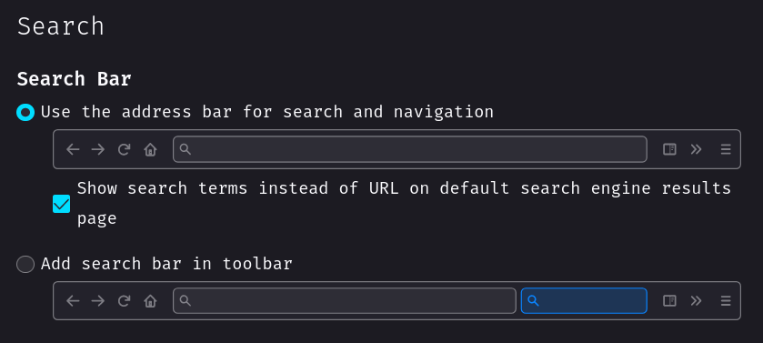

# About

My Tailor-Fitted highly customized and advanced [Firefox](https://www.mozilla.org/en-US/firefox) configuration.

## Note

This repository is not meant to be used as a whole, but rather as a reference for my own configuration. I do not recommend using it as is, as it is not meant to be used by anyone else. I do not provide any support for this repository. If you want to use it, you are on your own.

I recommend using a Firefox account and sync everything. Make sure to disable telemetry (all telemetry actually) in the settings ;)

## Features

- Sidebar (Sidebery) with over and auto-hide mechanism
- Hovercards
- Scrollable through tabs
- Search bar for tabs in the sidebar
- Custom toolbar button icons
- Custom (bouncing) loading indicator animation
- Only icons in extensions menu
- Icons in main menu items
- Round UI items
- Compact about:config list
- Various sidebar (sidebery, tree-style-tab) tweaks including auto-hide
- Glow and scale effect on hover on toolbar buttons
- Hidden horizontal tab bar
- Bottom main toolbar and search/url bar
- Customized findbar with auto-hide mechanism
- Hidden bookmarks toolbar (When enabled, it is visible on hover)
- Custom colors on various items
- Centered text in the url bar
- Colored overlay on the url bar based on the type of the connection
- RGB animation on the url bar address
- Other various fixes and tweaks
- Custom addons configuration
- Userscripts
- Userstyles
- Custom theme

## Where do each files go

| File    | Location                              |
| ------- | ------------------------------------- |
| user.js | ~/.mozilla/firefox/<path_ID>.default/ |
| chrome  | ~/.mozilla/firefox/<path_ID>.default/ |

NB: You can find your default profile in `~/.mozilla/firefox/profiles.ini`.

Per addon configuration files are located in addons directory.

## Additional tweaks

### Toolbar

Go to `Open application menu > More tools > Customize toolbar...` and make the following changes:

#### Bookmarks

### General

### Home

### Search

## Addons

You can find list of addons I use [here](https://addons.mozilla.org/en-US/firefox/collections/17970682/TAT-Collection/).

## Userscripts (Violentmonkey)

## Stylus styles

## Theme

The theme I'm currently using: [RosyBrown Dark by Me](https://addons.mozilla.org/en-US/firefox/addon/rosybrown_dark/)

## Notable Mentions

[schizofox](https://github.com/schizofox/schizofox) - Hardened Firefox flake for the delusional and the schizophrenics. You might find some interesting stuff there.

[FirefoxCSS-Store](https://firefoxcss-store.github.io) - A collection site of Firefox userchrome themes.

[r/FirefoxCSS](https://www.reddit.com/r/FirefoxCSS) - A subreddit dedicated to Firefox customization.

[SearchFox](https://searchfox.org) - A source code indexing tool for Mozilla Firefox. It indexes C++, Rust, and JavaScript code.
