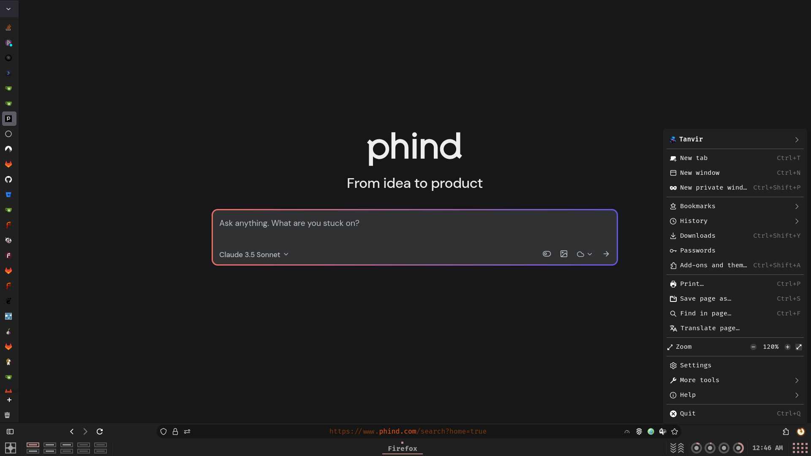
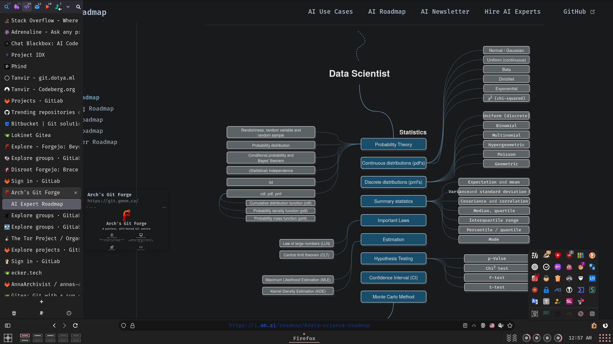
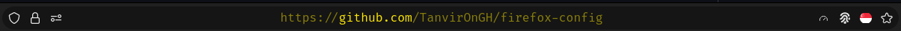
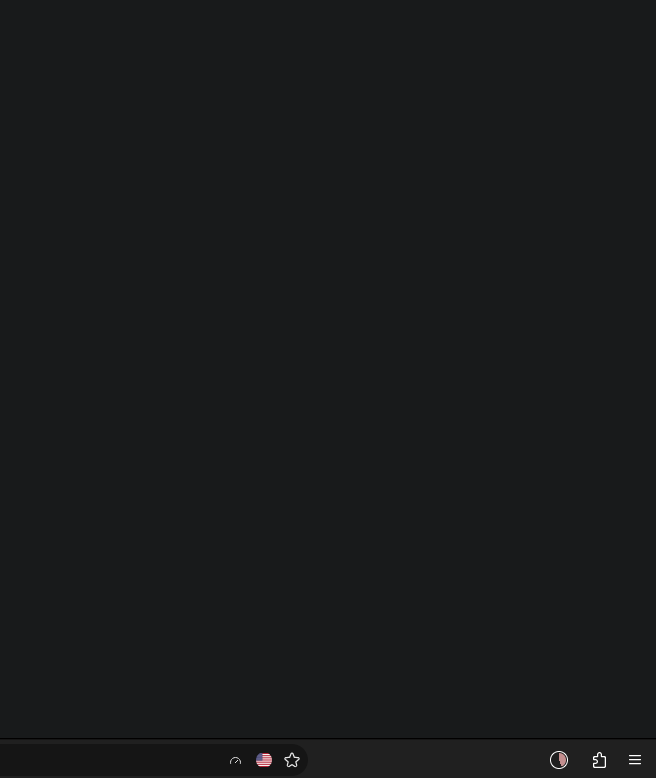
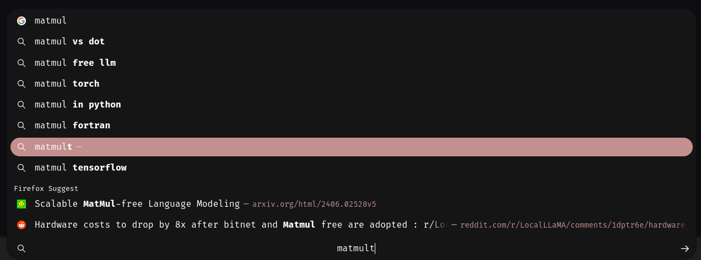
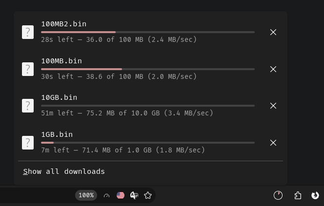
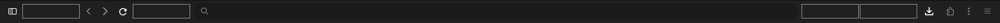
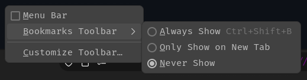
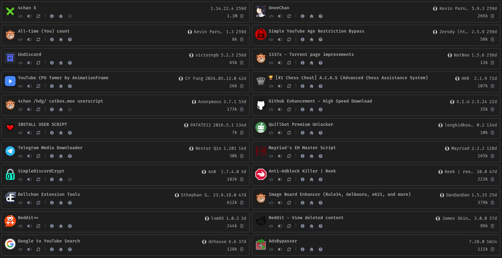
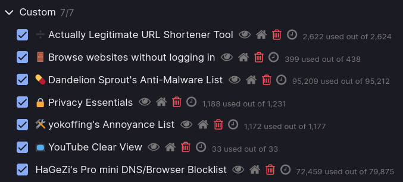

# About

My Tailor-Fitted highly customized and advanced [Firefox](https://www.mozilla.org/en-US/firefox) configuration.

> [!NOTE]  
> This repository is not meant to be used as a whole, but rather as a reference for my own configuration. I do not recommend using it as is, as it is not meant to be used by anyone else. I do not provide any support for this repository. If you want to use it, you are on your own.

> [!TIP]
> Disable Telemetry and Data Collection: Ensure that all telemetry and data collection features are turned off in Firefox. You can use my `user.js` as a reference, and explore other `user.js` files and hardened Firefox configurations for additional security.
>
> Cookie Management: With cookie isolation enabled, clearing cookies may be less effective. Instead, consider using temporary containers for better privacy.
>
> Customizing Firefox: For detailed guidance on customizing Firefox to suit your needs, refer to the [Customizing Firefox](#customizing-firefox) section.

## Features

- Smooth scrolling
- Animations
- Sidebar (Sidebery) with auto-hide mechanism
- Hovercards
- Scrollable through tabs
- Search bar for tabs in the sidebar
- Custom toolbar button icons
- Custom (bouncing) loading indicator animation
- Only icons in extensions menu
- Icons in main menu items
- Round UI items
- Compact about:config list
- Various sidebar (sidebery, tree-style-tab) tweaks including auto-hide
- Consistent and matching colors across various elements and the UI
- Glow and scale effect on hover on toolbar buttons
- Findbar as floating box at the top
- Hidden horizontal tab bar
- Bottom main toolbar and search/url bar
- Hidden bookmarks toolbar visible on hover
- Custom colors on various items
- Centered text in the url bar
- Colored overlay on the url bar based on the type of the connection
- RGB animation on the url bar address
- Other various fixes and tweaks
- Custom addons configuration
- Userscripts
- Userstyles
- Custom theme
- Various performance and privacy tweaks

## Where do each files go

| File    | Location                              |
| ------- | ------------------------------------- |
| user.js | ~/.mozilla/firefox/<path_ID>.default/ |
| chrome  | ~/.mozilla/firefox/<path_ID>.default/ |

NB: You can find your default profile in `~/.mozilla/firefox/profiles.ini`.

Per addon configuration files are located in addons directory.

## Additional tweaks

### Toolbar

Go to `Open application menu > More tools > Customize toolbar...` and make the following changes:

Set Density to `Normal` and uncheck Title Bar.

To disable bookmarks toolbar:

## Customizing Firefox

If you're planning to make multiple and extensive alterations to your UI, learning how to use the [Browser Toolbox](https://firefox-source-docs.mozilla.org/devtools-user/browser_toolbox/index.html) is essential. It allows you to create modifications to the UI and fix those modifications if a newer version of the Firefox codebase causes issues.

While the Browser Toolbox isn't particularly user-friendly to set up or use initially, perseverance will pay off as it is key to inspecting Firefox's UI. Check out the [r/firefoxcss wiki](https://www.reddit.com/r/FirefoxCSS/wiki/index/) and search the subreddit for specific posts.

Investigate how to use Mozilla's source code indexing tool [SearchFox](https://searchfox.org) as well.

Most of your "How to" questions can be answered by the Browser Toolbox and SearchFox, though it takes some time to understand them both from scratch.

As an alternative to using the Browser Toolbox and SearchFox, you can explore the wealth of information in subreddits like [r/FirefoxCSS](https://www.reddit.com/r/FirefoxCSS), [r/firefox](https://www.reddit.com/r/firefox/) and [r/unixporn](https://www.reddit.com/r/unixporn/). Finding the precisely relevant information often requires diligent searching with a variety of **keywords**. A useful trick is to search with a section of CSS userstyle, a selector, or a rule related to the UI element you want to modify. You can also look on GitHub, GitLab, and other code hosting sites, or simply use your favorite search engine. There are various articles and blogs online as well. Discord servers like [unixporn](https://discord.com/invite/unixporn) can be helpful too.

Look for specific topics in github: [userchrome](https://github.com/topics/userchrome), [firefox-css](https://github.com/topics/firefox-css), [firefox-tweaks](https://github.com/topics/firefox-tweaks), [userchrome-styles](https://github.com/topics/userchrome-styles), [userchromecss](https://github.com/topics/userchromecss)

More handy resources: [userchrome.org](https://www.userchrome.org), [FirefoxCSS Store](https://firefoxcss-store.github.io), [Mozilla Bugzilla](https://bugzilla.mozilla.org)

## Theme

The theme I'm currently using: [RosyBrown Dark by Me](https://addons.mozilla.org/en-US/firefox/addon/rosybrown_dark/)

## Addons

You can find list of addons I use [here](https://addons.mozilla.org/en-US/firefox/collections/17970682/TAT-Collection/).

## Userscripts

## Stylus styles

## Ublock origin

Enabled all filters except for the regional ones. And added some custom filters:

## Notable Mentions

- [schizofox](https://github.com/schizofox/schizofox) - Hardened Firefox flake for the delusional and the schizophrenics. You might find some interesting stuff there.
- [Betterfox](https://github.com/yokoffing/Betterfox) - Firefox user.js for speed, privacy, and security. Your favorite browser, but better.
- [FirefoxCSS-Store](https://firefoxcss-store.github.io) - A collection site of Firefox userchrome themes.
- [r/FirefoxCSS](https://www.reddit.com/r/FirefoxCSS) - A subreddit dedicated to Firefox customization.
- [SearchFox](https://searchfox.org) - A source code indexing tool for Mozilla Firefox. It indexes C++, Rust, and JavaScript code.
- [ArkenFox GUI](https://arkenfox.github.io/gui) - Site to help you explore the information from the [arkenfox user.js](https://github.com/arkenfox/user.js)
