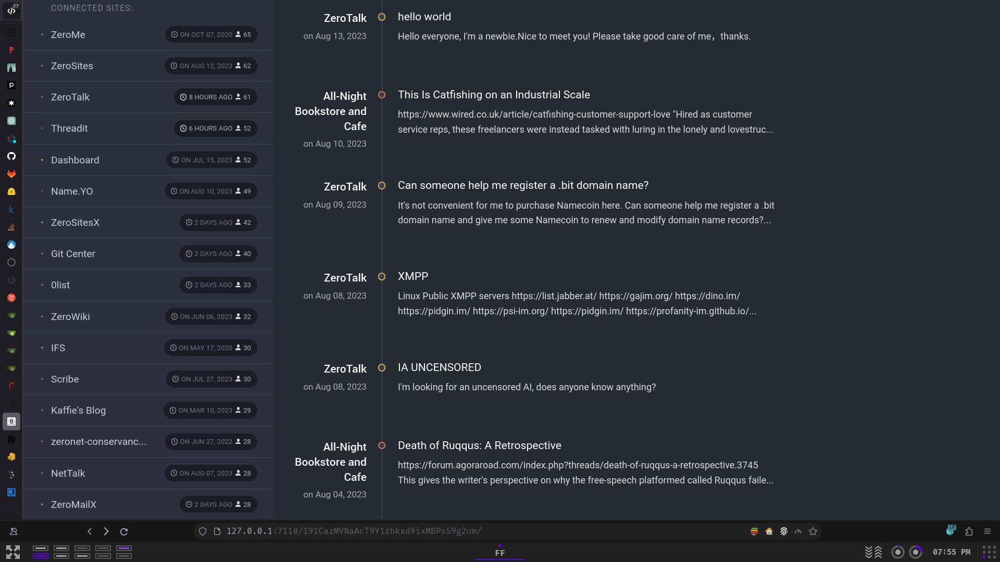
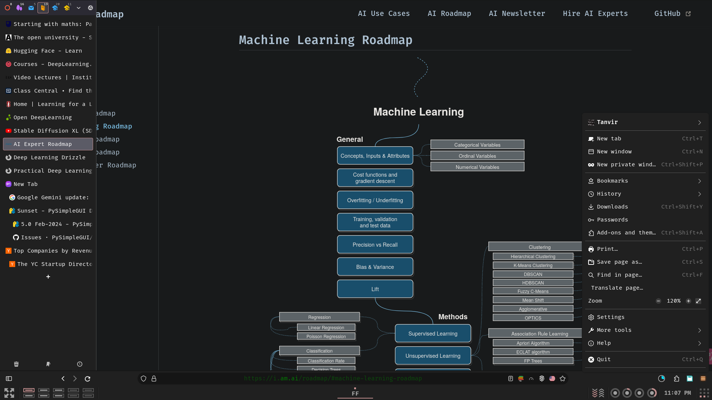
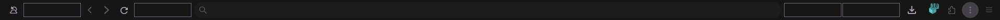
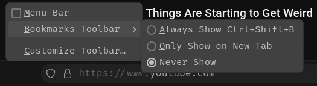
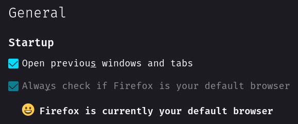
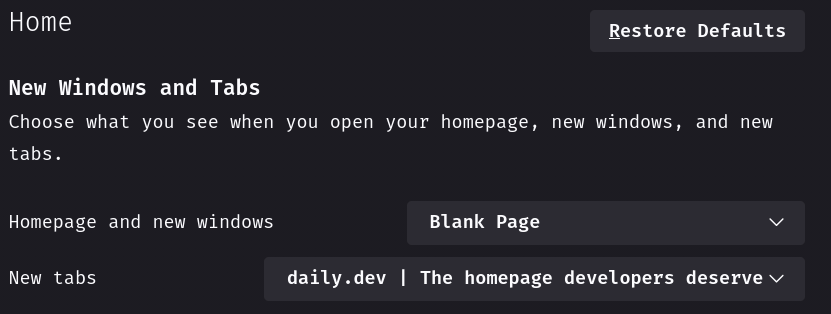
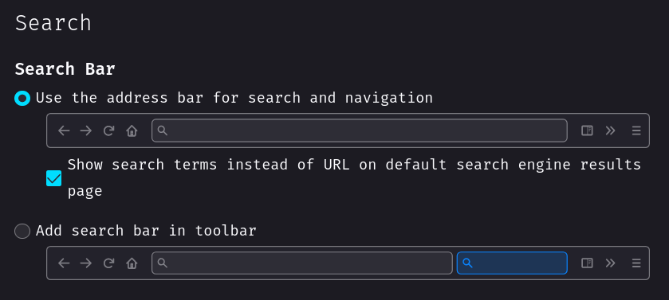
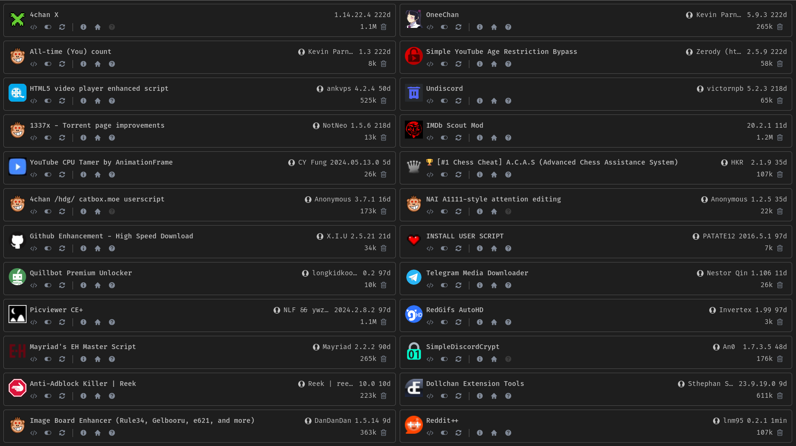

# About

My Tailor-Fitted highly customized and advanced [Firefox](https://www.mozilla.org/en-US/firefox) configuration.

## Note

This repository is not meant to be used as a whole, but rather as a reference for my own configuration. I do not recommend using it as is, as it is not meant to be used by anyone else. I do not provide any support for this repository. If you want to use it, you are on your own.

I recommend using a Firefox account and sync everything. Make sure to disable telemetry (all telemetry actually) in the settings ;)

## Where do each files go

| File    | Location                              |
| ------- | ------------------------------------- |
| user.js | ~/.mozilla/firefox/<path_ID>.default/ |
| chrome  | ~/.mozilla/firefox/<path_ID>.default/ |

NB: You can find your default profile in `~/.mozilla/firefox/profiles.ini`.

Per addon configuration files are located in addons directory.

## Additional tweaks

### Toolbar

Go to `Open application menu > More tools > Customize toolbar...` and make the following changes:

#### Bookmarks

### General

### Home

### Search

## Addons

You can find list of addons I use [here](https://addons.mozilla.org/en-US/firefox/collections/17970682/TAT-Collection/).

## Userscripts

## Theme

The theme I'm currently using: [RosyBrown Dark by Me](https://addons.mozilla.org/en-US/firefox/addon/rosybrown_dark/)
